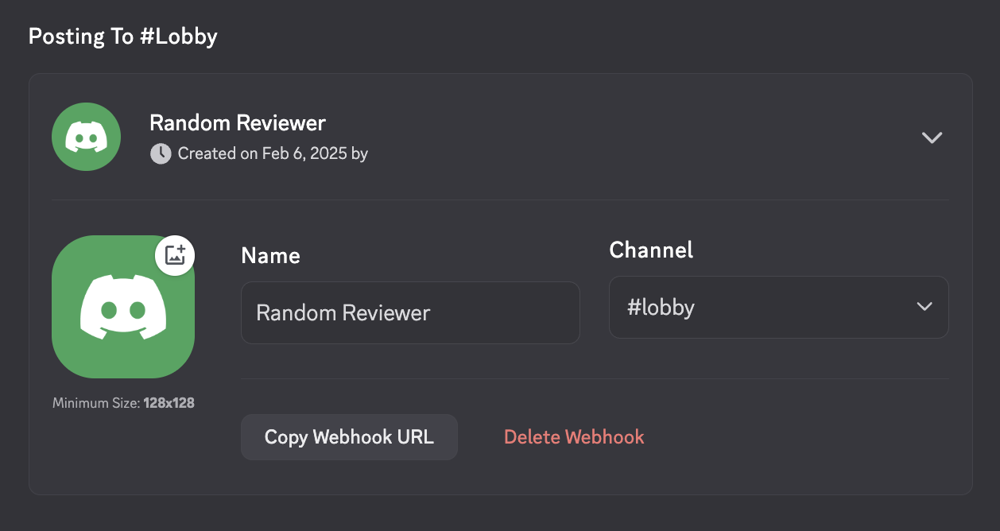
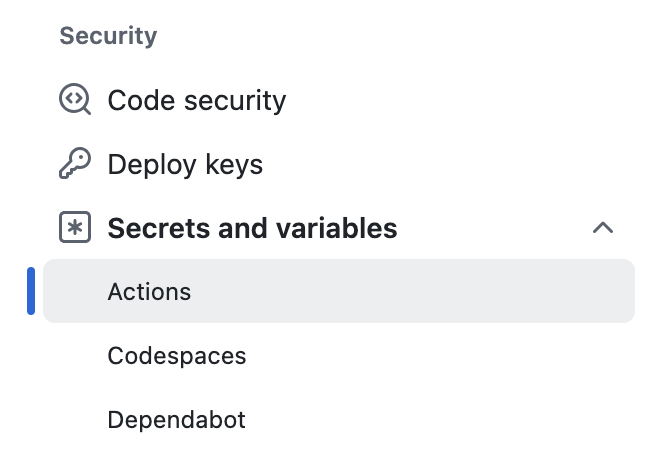
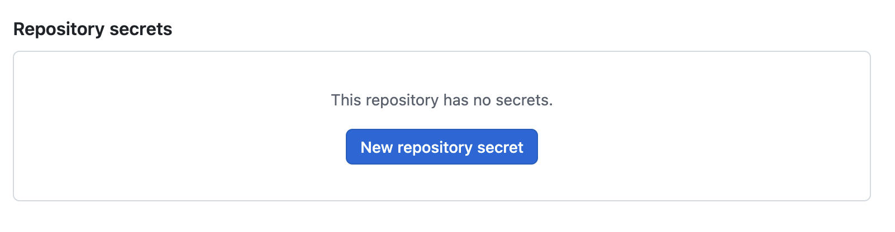

# Random Reviewer Discord


[](https://github.com/actions/typescript-action/actions/workflows/check-dist.yml)
[](https://github.com/actions/typescript-action/actions/workflows/codeql-analysis.yml)
[](./badges/coverage.svg)

Automatically assign reviewers at random and notify them on Discord!

## Table of Contents

- [How to Install on Your Repository](#how-to-install-on-your-repository)
  - [Create Discord Webhook URL](#create-discord-webhook-url)
  - [Configure Repository Secrets](#configure-repository-secrets)
  - [Add Action Configuration File](#add-action-configuration-file)
- [Customize It](#customize-it)
  - [Supported Events and Activity Types](#supported-events-and-activity-types)
  - [Exclude Some Usernames](#exclude-some-usernames)
  - [Edit the Message Templates](#edit-the-message-templates)

## How to Install on Your Repository

### Create Discord Webhook URL

> [!NOTE]
> To create a Webhook, you should be the admin👑 or have the `Manage Webhooks` permission.

1. In your Discord server, go to **Server Settings** and click **Integrations**.
1. Click **Webhooks**.
1. If you haven't created any webhooks, a new webhook will be created automatically. If not, click **New Webhook**.
1. Change the name and profile picture as you like. This action doesn't have a default name or profile picture for the webhook.
   
1. Click **Copy Webhook URL** and save it for later. (Or you can come back here and copy it again!)

### Configure Repository Secrets

> [!WARNING]
> You can skip this step and add these values directly in the `.yaml` file,
> but exposing Discord user IDs and the webhook URL is NEVER a good idea.

You need two secrets:

- `WEBHOOK_URL`
- `USERNAMES`

1. On your GitHub repository page, go to **Settings** and click **Secrets and variables > Actions**.
   
1. Under **Repository secrets**, click **New Repository Secret**.
   
1. Name it `WEBHOOK_URL` and paste your Discord Webhook URL.
1. Create another secret named `USERNAMES`, and the secret should contain the usernames for reviewers.

The format should be:

```
githubusername1:discorduserid1
githubusername2:discorduserid2
githubusername3:discorduserid3
```

and so on. To find a Discord User ID, follow [this official document](https://support.discord.com/hc/en-us/articles/206346498-Where-can-I-find-my-User-Server-Message-ID).

### Add Action Configuration File

<!-- prettier-ignore -->
> [!IMPORTANT] 
> **This action is not stable yet** and upcoming minor versions may have breaking changes.
> Specify the full version (e.g., `JedBeom/random-reviewer-discord@v0.2.0`) instead of using `v0`.

Create a file `.github/workflows/random-reviewer.yaml` and paste the following:

```yaml
name: Random Reviewer Discord

on:
  pull_request:
    types:
      - opened
      - reopened
      - ready_for_review
      - review_requested
    branches:
      - main
  pull_request_review:
    types:
      - submitted
  schedule:
    - cron: 0 10 * * 6

permissions:
  pull-requests: write

jobs:
  assign-reviewer:
    runs-on: ubuntu-latest
    steps:
      - name: Run random-reviewer-discord
        uses: JedBeom/random-reviewer-discord@v0.2.0
        env:
          GITHUB_TOKEN: ${{ secrets.GITHUB_TOKEN }}
        with:
          usernames: ${{ secrets.USERNAMES }}
          webhook_url: ${{ secrets.WEBHOOK_URL }}
```

> [!IMPORTANT]
> Don't forget to add `permissions`! This action requires `pull-requests: write`.

> [!NOTE]
> To copy the file with full options: see [example.yml](./example.yml).
> For default values and descriptions, see [action.yml](./action.yml).

Add(Stage) the file, commit it to a new branch, push it, and create a PR.

## Customize It

### Supported Events and Activity Types

This action supports the following events:

- [`pull_request`](https://docs.github.com/en/actions/writing-workflows/choosing-when-your-workflow-runs/events-that-trigger-workflows#pull_request) ([Webhook](https://docs.github.com/en/webhooks/webhook-events-and-payloads#pull_request))
  - `opened`: Assign the reviewer on random if no reviewers were assigned.
  - `reopened`: Notify the requested reviewers if present. Otherwise, assign on random among the previous reviewers or the assignees.
  - `ready_for_review`: (same as `reopened`)
  - `review_requested`: Notify the requested reviewer(s). Requesting on the closed/draft PRs would not fire the alert by default.
- [`pull_request_review`](https://docs.github.com/en/actions/writing-workflows/choosing-when-your-workflow-runs/events-that-trigger-workflows#pull_request_review) ([Webhook](https://docs.github.com/en/webhooks/webhook-events-and-payloads#pull_request_review))
  - `submitted`: Notify the author when the review was submitted.
- [`schedule`](https://docs.github.com/en/actions/writing-workflows/choosing-when-your-workflow-runs/events-that-trigger-workflows#schedule): Remind reviewers who were requested reviews but haven't done yet.

Other event types would be ignored with an error.

### Exclude Some Usernames

You may want to exclude some users from the usernames. Add `#` in front of the line to exclude them.

For example, if `user2` should be excluded,

```
user1:1111111111111111111
#user2:2222222222222222222
user3:3333333333333333333
```

adding `#` in front of `user2`'s line makes the action ignore them. Remove `#` if you want to include them again.

### Edit the Message Templates

You can customize the Discord message using the `template_*` inputs.
See [action.yml](./action.yml) for the list of templates and examples.

Each templates except `template_schedule` supports the following variables:

- `{mention}`: Mention of the notification target. Mostly it is the reviewer(s). For `template_review_submitted_*`, this is the mention of the author.
  - e.g. `<@1111111111111111111>` or `<@1111111111111111111> <@2222222222222222222>`
- `{prTitle}`: The title of the pull request.
  - e.g. `Remove unused dependencies`
- `{prNumber}`: Number uniquely identifying the pull request within its repository.
  - e.g. `314`
- `{prURL}`: URL of the pull request.
  - e.g. `https://github.com/JedBeom/random-reviewer-discord/pull/9`

Some templates support additional variables:

- `{sender}`: A GitHub username of the user who requested the review.
  - supported templates:
    - `template_review_requested_one`
    - `template_review_requested_plural`
  - e.g. `JedBeom`
- `{reviewer}`: A GitHub username of the reviewer.
  - supported templates:
    - `template_review_submitted_commented`
    - `template_review_submitted_changes_requested`
    - `template_review_submitted_approved`
