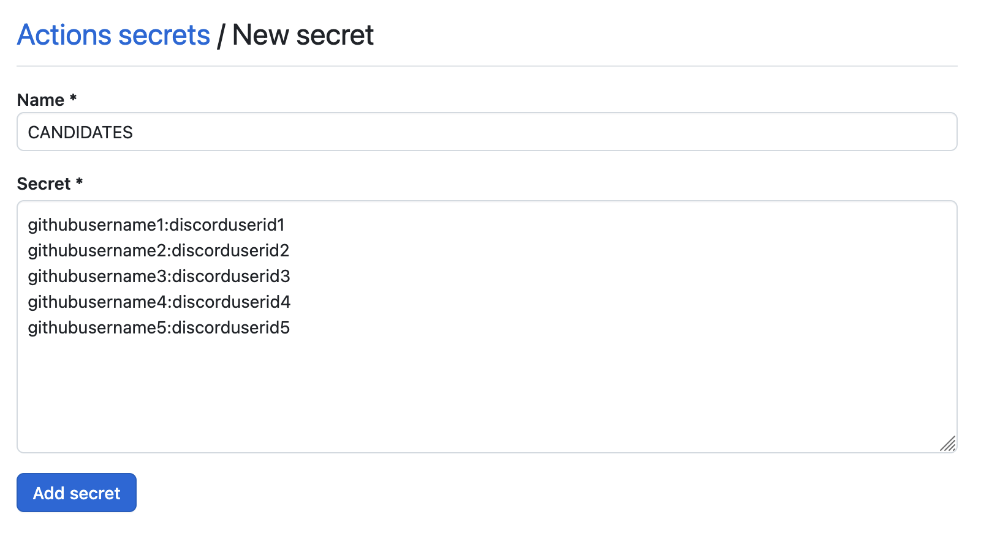

# Random Reviewer Discord

[](https://github.com/super-linter/super-linter)

[](https://github.com/actions/typescript-action/actions/workflows/check-dist.yml)
[](https://github.com/actions/typescript-action/actions/workflows/codeql-analysis.yml)
[](./badges/coverage.svg)

**This action is not stable yet** and upcoming minor versions may have breaking changes.
Specify the full version(e.g. `JedBeom/random-reviewer-discord@v0.1.0`) instead of using `v0`.

Automatically assign reviewers at random and notify them on Discord! 

## How to Install on Your Repository

### Create Discord Webhook URL

> To create Webhook, you should be the admin👑 or have the permission `Manage Webhooks`.

1. In your Discord server, Go to **Server Settings** and click **Integrations**.
1. Click **Webhooks**.
1. If you haven't created any webhooks, then a new webhook would be created automatically. If not, then click **New Webhook**.
1. Change name and profile pic as you want. This action doesn't have a default name and profile pic for webhook.
   
1. Click **Copy Webhook URL** and save it for later. (Or you can come here and copy again!)

### Configure Repository Secrets

> You could pass this step and add these values directly on the `.yaml`, but exposing discord user ids and webhook url is NEVER a good idea.

1. On your Github repository web page, Go to **Settings** and click **Secrets and variables > Actions**.
   
1. Under **Repository secrets**, click **New Repository Secret**.
   
1. Name `WEBHOOK_URL` and paste your Discord Webhook URL you created.
1. Create another secret and name `CANDIDATES` for the name, and the secret contains candidates of reviewers.
   

The format should be

```
githubusername1:discorduserid1
githubusername2:discorduserid2
githubusername3:discorduserid3
```

and so on. To find Discord User ID, follow [this official document](https://support.discord.com/hc/en-us/articles/206346498-Where-can-I-find-my-User-Server-Message-ID).

### Add action configuration file

Create a file `.github/workflows/random-reviewer.yaml` and paste the following:

```yaml
name: Random Reviewer Discord

on:
  pull_request:
    branches:
      - main

permissions:
  pull-requests: write

jobs:
  assign-reviewer:
    runs-on: ubuntu-latest
    steps:
      - name: Assign random reviewer
        uses: JedBeom/random-reviewer-discord@main
        env:
          GITHUB_TOKEN: ${{ secrets.GITHUB_TOKEN }}
        with:
          candidates: ${{ secrets.CANDIDATES }}
          webhook_url: ${{ secrets.WEBHOOK_URL }}
          template: "Yay! <@{userID}> is the reviewer of [PR #{prNumber}]({prURL})!"
```

> ‼️ Don't forget to add `permissions`! This action only requires `pull-requests: write`.

Add the file, commit it on the new branch, push it, and create a PR.

## Customize it

### Exclude some candidates

You may want to exclude some users from candidates. Then add `#` in front of the line.

For example, if `user2` should be excluded,

```
user1:1111111111111111111
#user2:2222222222222222222
user3:3333333333333333333
```

adding `#` in front of the line of user2 makes the action ignore them. Remove `#` if you want to include them.

### Edit the message

You can customize the discord message using the input `template`. `template` supports the following variables:

- `{userID}`: discord user id of the selected reviewer. Wrap it with `<@` and `>` to mention.
- `{prNumber}`: number of the pull request
- `{prURL}`: Url of the pull request
